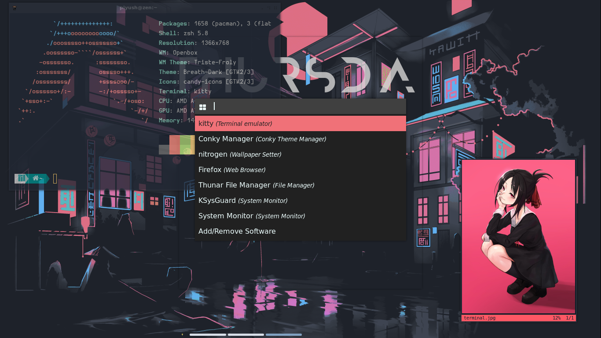

# D O T F I L E S  

## About
My dotfile organization repository! Contains config files for my current openbox setup. This is currently working in majaro, but I assume it should work (with modification) on other distros.
1. screenshots
2. packages

## S C R E E N S H O T S


# Packages
1. Decor
2. keybinding
3. App
4. Terminal
5. openbox


## Decor

1. Wallpaper
	- https://github.com/ThePrimeagen/anime
	- https://github.com/linuxdotexe/nordic-wallpapers
	- https://github.com/FrenzyExists/wallpapers
	- 
2. font
	- terminal
	- IDE

```sh
sudo pacman -S otf-hermit
```

## Keybinding

__window__
mod + Q : quit
mod + -> / mod + <- / ^ : window shift
mod + z : minimize
mod + x : maximize
alt + tab : switch tab
mod + alt + -> : switch workspace
alt + space : window_option

__app__
mod + T : terminal
mod + space : launcher
mod + enter : 
mod + D : Desktop
mod + B : Browser
mod + O : Screen_Shot 
mod + F : File Manager

## Applcations
- ScrrenBrightness : screendimmer
- terminal : kitty
- IDE : Sublime
- Image Viewr : sxiv
- File Manager : thunar
- browser : chromium,min,firefox
- Doc Viewer : zathura 
- screenshot : scrot

```sh
sudo pacman -S kitty sxiv thunar chromium min firefox scrot zathura-pdf-poppler
# Kitty theme
git clone --depth 1 git@github.com:dexpota/kitty-themes.git ~/.config/kitty/kitty-themes
cd ~/.config/kitty
ln -s ./kitty-themes/themes/Floraverse.conf ~/.config/kitty/theme.conf
echo "include ./theme.conf" >> kitty.conf
```
- change ff->hermit fs-> 13


## [Terminale Utility](https://github.com/Geektrovert/AwsTerm)
- youtube-dl
- asciinema
- bat
- micro
- glow
- cmus
- bsd-games
- rip-grep
- fd
- fzy
- tree
- tmux
- ranger
- yay
- [tldr](https://tldr.sh/)
- ufetch
- node

```sh
sudo pacman -S asciinema bat micro glow rip-grep fd fzy tree tmux ranger tldr ufetch yay
# ufetch
mkdir ~/.pscript
cd ~/.pscript
git clone https://github.com/Piyush-linux/Linux_Config/blob/main/bash/ufetch.sh
chmod +x ufetch.sh
echo "~/.pscript/ufetch.sh" >> ~/.zshrc
```

### aliass

- `paste into ~/.zshrc`

```sh
alias l="tree -L 1"
alias m="micro"
alias show="bat"
# conf
alias zshC="micro ~/.zshrc"
alias openboxC="micro ~/.config/openbox/rc.xml"
alias rofiC="micro ~/.config/rofi/"
alias kittyC="micro ~/.config/kitty/kitty.config"
# wifi
alias getwifi="nmcli d wifi list"
alias setwifi="nmcli c up" #setwifi <name> --ask
```

### Refresh
```sh
source ~/.zshrc
```


## Openbox Setup
- tint2
- rofi
- dunst
- [conky](https://github.com/addy-dclxvi/Conky-Theme-Collections)
- compton
- nitrogen
- openbox
	- obconf
	- obmenu-generator
	- lxappearance

```sh
sudo pacman -Sy openbox nitrogen obconf rofi tint2 kitty obmenu-generator compton lxappreance
```
### tint2
1. install theme
2. change user_name
```sh
# 1. installing theme
# 2. change user name if needed
git clone https://github.com/addy-dclxvi/tint2-theme-collections ~/.config/tint2 --depth 1 &&
# tint2 -c ~/.config/tint2/blocks/blocks.tint2rc &
tint2 -c ~/.config/tint2/tint2-theme-collections/minima.tintrc
# run> tint2conf
```

### rofi
1. install theme
2. set theme
```sh
mkdir ~/.config/rofi/themes
# cd /usr/share/rofi/themes
~/.config/rofi/themes sudo git clone https://github.com/Murzchnvok/rofi-collection
# move all *.rasi ino corrent folder 
# > rofi-theme-selector
```

### dunst
- https://www.addictivetips.com/ubuntu-linux-tips/set-up-better-system-notifications-on-linux-with-dunst/
- https://draculatheme.com/dunst
```sh
mkdir ~/.config/dunst
cd ~/.config/dunst
# git clone my dunst
```

### Openbox
1. install theme
2. set conf
3. set theme
```sh
# openbox
# - https://www.devpy.me/your-guide-to-a-comfortable-linux-desktop-with-openbox/
git clone https://github.com/addy-dclxvi/openbox-theme-collections ~/.themes &&
cd ~/.config/openbox &&
git clone https://github.com/Piyush-linux/Linux_Config/blob/main/openbox/autostart &&
git clone https://github.com/Piyush-linux/Linux_Config/blob/main/openbox/rc.xml &&
obmenu-generator -s
# run> obconf 
# run> lxappearance
```
# Dir
- screenShot.png
- config
	- openbox
	- rofi
	- tint2
	- kitty 
- terminal

## Future Configuration

I am thinking of switching to i3-gaps
## i3
- install i3 i3-gaps i3status i3lock autotiling[yay]
mod+enter : terminal
mod+shf+Q : Quit
mod + <- / mod + -> / mod + ^ : switch win

### Helpfull Resources
- https://thomashunter.name/posts/2019-01-27-treating-openbox-like-a-tiling-windowmanager
- http://melp.nl/2011/01/10-must-have-key-and-mouse-binding-configs-in-openbox/
